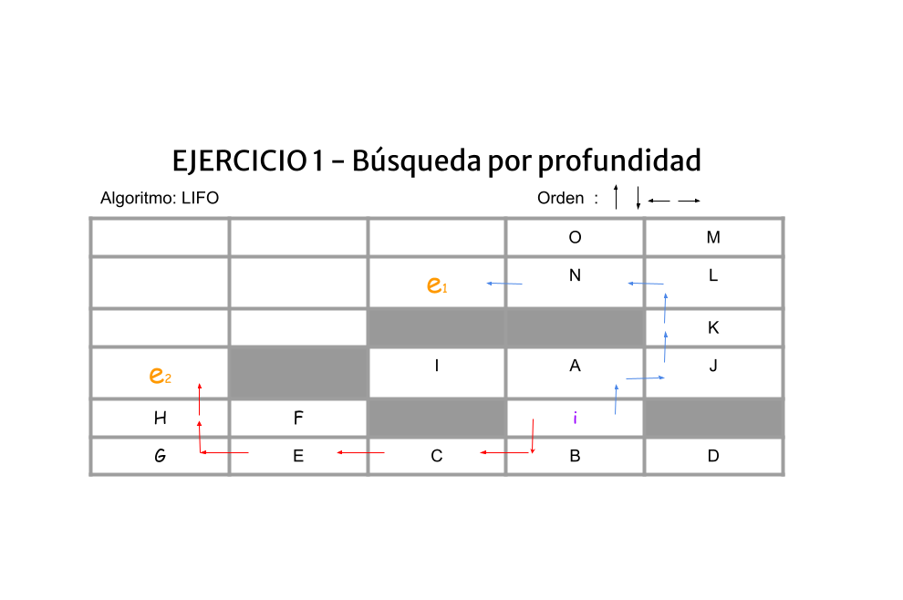

### Para empezar, ¿qué es un algoritmo de Profundidad?

El algoritmo de búsqueda en Profundidad es un algoritmo de búsqueda no informada que explora el espacio de estados avanzando lo más profundo posible por cada rama antes de retroceder.  
Parte del estado inicial y continúa explorando un camino hasta que alcanza el objetivo o no puede seguir avanzando, momento en el que retrocede para explorar otras ramas.

Este algoritmo utiliza una **pila (LIFO)** y es eficiente en uso de memoria, aunque no garantiza encontrar la solución más corta.

---

### Consideraciones:

* Para aquellos algoritmos en los que no es relevante el coste, el orden de los operadores (movimientos) es: **arriba, abajo, izquierda, derecha**.
* Si algún algoritmo no controla los ciclos, supondremos que existen mecanismos para eliminarlos.
* **El coste del movimiento:**
    * **Vertical:** 1
    * **Horizontal:** 2

---

## Explicación de la búsqueda
Usamos un **Algoritmo LIFO (Pila)**.

**Su regla de orden:** El elemento más reciente que guardas es el primero que tienes que sacar. No puedes sacar lo que está debajo sin quitar lo que pusiste al final.

**Explicación ejemplificada:** Una pila de libros o la bandeja de entrada de documentos físicos (lo último que llega se queda arriba y es lo primero que atiendes).

### Esquema: E={} F={} T(i)= F

* **E={}:** Se refiere a los nodos ya explorados.
* **F={}:** Se refiere a los nodos de frontera (aún no explorados).
* **T(x):** Se refiere al nodo actual del que vamos a descubrir sus fronteras.
* **= F o = T:** Se refiere a si ha encontrado el nodo objetivo. En este caso "e", tiene dos variaciones: **F** (False) o **T** (True).

---

### Búsqueda de **e1**

E={} F={**i**} T(i)= F  
E={i} F={A, **B**} T(B)= F  
E={i, B} F={A, C, **D**} T(D)= F  
E={i, B, D} F={A, **C**} T(C)= F  
E={i, B, D, C} F={A, **E**} T(E)= F  
E={i, B, D, C, E} F={A, F, **G**} T(G)= F  
E={i, B, D, C, E, G} F={A, F, **H**} T(H)= T  

**Solución:** `i -> B -> C -> E -> G -> H -> e1`

---

### Búsqueda de **e2**

#### Excepciones:
**El orden de prioridades de búsqueda cambia.** **Nuevo orden:** [abajo, arriba, izquierda, derecha]  

*En este caso no pondré límite de profundidad, simplemente empezaré por arriba.*

Como he explicado, **LIFO** funciona siendo lo último que entra lo primero que exploras. Pero al tener 2 puntos de interés, haré como si el orden de prioridades fuese al revés (abajo es más importante que arriba, entonces empezamos la búsqueda por A). Esto también puede realizarse al poner un límite de búsqueda (límite de profundidad) para obligar a no encontrar un punto y empezar por el otro lado.

E={} F={**i**} T(i)= F  
E={i} F={B, **A**} T(A)= F  
E={i, A} F={B, J, **I**} T(I)= F  
E={i, A, I} F={B, **J**} T(J)= F  
E={i, A, I, J} F={B, **K**} T(K)= F  
E={i, A, I, J, K} F={B, **L**} T(L)= F  
E={i, A, I, J, K, L} F={B, M, **N**} T(N)= T  

**Solución:** `i -> A -> I -> J -> K -> L -> N -> e2`